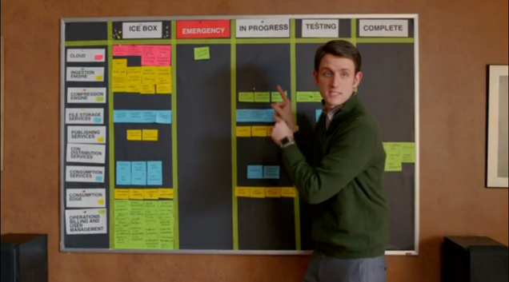
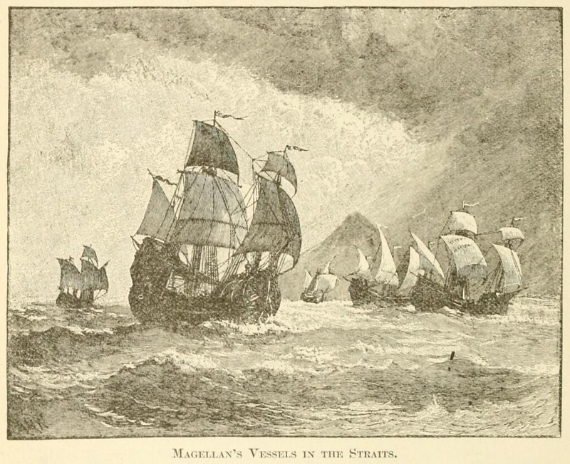
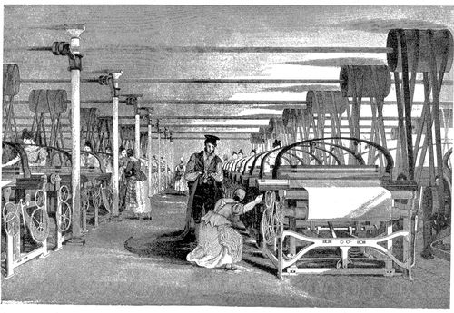

> This is a writeup of a presentation I gave to the [Jackson Area Web and Application Developers meetup](https://www.meetup.com/Jackson-Area-Web-And-App-Developers/) in August 2019.

## Software Process Defined

What is a "software process" and do I have/need one? Basically, it's exactly what it sounds like - the process you or your company takes to build, test, and release a piece of software. So whether you're a solo developer working on side projects at home or part of a huge team at a multi-billion dollar business, you are implementing some form of software process whether you realize it or not.

I started working at Kopis Mobile in December 2016. Since that time, we have made it a focus to improve and streamline our software process. Today, I'm going to take you on a journey though the eras of software process we've been through at Kopis Mobile, starting in the Dark Ages.

## The Dark Ages

Honestly, even the Dark Age would have been an improvement for our software process - we were more like cavemen right after the discovery of fire.

We were comfortable with Git and using it in a team setting. We used a modified Git Flow branching scheme to provide some structure to our Git environments. And that was about the extent of our software process at the time. Everything else was a bit of a mess: deploy keys for Android apps were stored on one person's machine (I think they were backed up on a CD somewhere?), every artifact we shipped to a customer was built on one developer's machine, there were lots of issues of "works on my machine".

There were six of us on the engineering team at the time, and we were very siloed. For the majority of project, there was one developer responsible for all of the new work done. We followed Deadline-Driven Development, where our priorities were set by what project had the closest deadline. It was stressful, it hurt morale (even if we may not have recognized it at the time), and we had a bad [bus factor](https://en.wikipedia.org/wiki/Bus_factor).

## The Renaissance

For us, the discovery that sparked our Renaissance was Agile and Scrum. But it wasn't an immediate hit. We had several on-and-off attempts at implementing Scrum before really committing to it late in 2017. Many of our "failures" stemmed from the belief that traditional Agile and Scrum didn't work for us. Things like:

- We had multiple products and contracts we were working on, but only one team
- Our deliverables were usually contractually obligated, not customer-driven
- Because of our market, we had limited customer interaction, which made it hard to get feedback and iterate

These challenges almost kept us from realizing the power of Scrum. A lot of our early difficulties revolved around us trying to force our process onto existing tools which gave us a lot of headaches. We used JIRA for a while because others in the company were using it, but it didn't work for us in engineering. We migrated to GitLab for our repository and tried using project issues to track features but that didn't work for us either.

The common problem was a lack of visibility/support for cross-product teams -- remember, we were a small team working on multiple projects concurrently. So, we went old-school, using a white board and color-coded sticky notes per project. This gave us the cross-project scrum board we wanted so bad. And it worked great, until we had a team member leave to work remotely for three months on the other side of the country. So, using the physical board as a prototype, we build a digital solution that tied into an OpenProject instance we had started using to plan and store features for future work.

While we were figuring out our tooling issued, we were also figuring out how to make the actual Scrum methodology work for our team. We started with two and then three week sprints, with half a day for planning at the start and half a day to share what we had accomplished with the team in review and discuss how things went in retro. For a while we combined those two half days into one long review/retro/planning day which we all decided after a while was too long to spend in the conference room together (the company at least catered lunch those days).

## Age of Exploration

Since the whole team finally had an idea of what everyone else was working on at any given time and where we as a team were headed. Along with this insight came a conscious desire to break down the silos and enforce cross training where we could. It was uncomfortable at times, but it was definitely the right idea. Encouraging people to work on things that they weren't used to working on forced us to learn each other's code and share some of that tribal knowledge that is inherent in a silo'd project.

Another way to help cross-training and code quality was the introduction of merge reviews. Previously, our process was to get a feature implemented, test it until you were satisfied, then merge it into our develop branch. Once we implemented merge reviews, we locked the develop branch so that all merges to develop had to go through a review and get approved by another team member before getting marked as done.

While we would never be fully interchangeable - and that was never the goal - everyone on the team benefitted from having someone else that knew from experience what problems they were going through and having someone else on the team to bounce ideas off of.
Just like the early explorers, we were learning more about our world and the challenges and possibilities it offered.

## The Industrial Revolution

As we continued our growth and learning, we began looking outward at what other companies were doing and what tools and processes we could use at our company. This sparked our Industrial Revolution. Just like the first Industrial Revolution revolved around transitioning from hand-made goods to machine-made ones, our Industrial Revolution involved automating a lot of the tedious tasks involved in software development. Since we were already using GitLab for our code repository, it made sense that our first major leap came from learning and implementing GitLab's Continuous Integration and Continuous Delivery (CI/CD) pipelines.

Typically when you run `git push` on your machine, the files are sent up to your repository and that's it - they just sit there. But there exists a way to employ a team of magical robot workers to take the code you have committed, build your application, run tests, and deploy it to your server or mobile app store of choice. There are many different CI providers out there: CircleCI, Jenkins, Travis CI, etc. GitLab has a built-in CI/CD solution - even their free tier offers some access to their CI runners that can build and test your code. We host GitLab on premises, so over time we have built a fleet of runners to build everything from PIC firmware to Android apps and everything in between.

This was the one change that I believe had the biggest impact on improving our software process as it helped a lot of our Dark Age problems. Software builds had to be reproducible on a runner - no more "but it works on my machine" issues. If it can't be built with a clean CI image, then it's like you it can't be built at all. Deploy keys and other secrets are stored in private variables that only runners have access to when they need them. So much of the tedious, repetitive actions are automated away, allowing you to focus on more important tasks.

## The Future

Our software process journey is far from over. There are still pain points that we are aware of and others I'm sure we haven't even considered yet. For now, there are two big areas of improvement we want to focus on - improving automated testing and code quality tooling and better ways to manage code maintenance and technical debt.

## Key Takeaways

1. **There are no "one size fits all" solutions** to software process. What works for us may not work for you exactly, so you need to figure out where you're at, where you're headed, and how you want to get there.
1. **Break down silos** - this was one of the best things we did to help morale.
1. **Invest in automated tooling** - there's no reason you should be stressing out over manual build and deploy processes in 2020.
1. **Take time to document, develop, and refine your software process** - just like with continuing education, there are always things to learn and improve about your own software process.

### Photo credits

Mechanical piping photo by <a href="https://unsplash.com/@martinadams?utm_source=unsplash&amp;utm_medium=referral&amp;utm_content=creditCopyText">Martin Adams</a> on <a href="/s/photos/process?utm_source=unsplash&amp;utm_medium=referral&amp;utm_content=creditCopyText">Unsplash</a>

Cavemen image from SpongeBob SquarePants on Nickelodeon

Silo photo by <a href="https://unsplash.com/@sebastiangrochowicz?utm_source=unsplash&amp;utm_medium=referral&amp;utm_content=creditCopyText">Sebastian Grochowicz</a> on <a href="/s/photos/process?utm_source=unsplash&amp;utm_medium=referral&amp;utm_content=creditCopyText">Unsplash</a>

Scrum board photo from Silicon Valley on HBO
