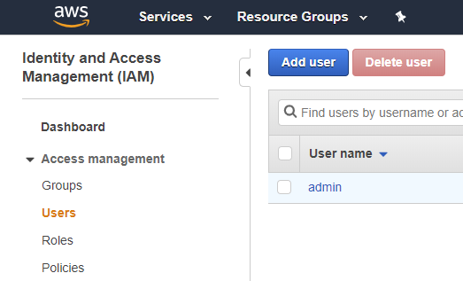
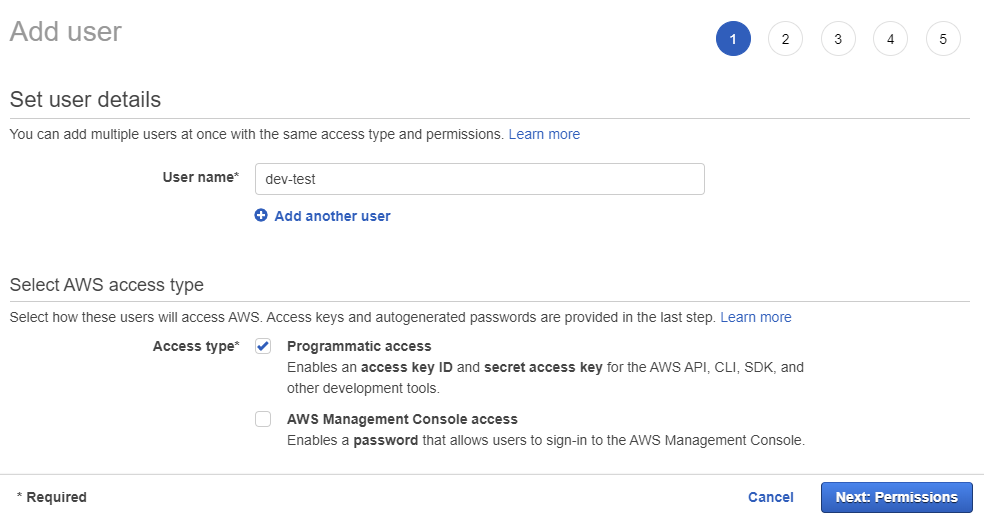
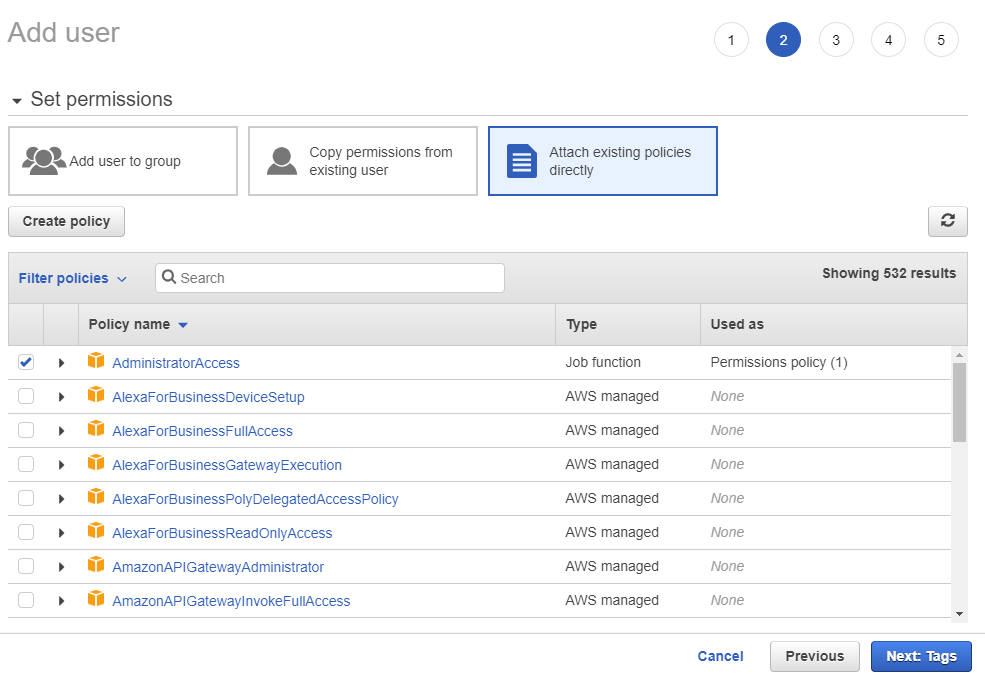
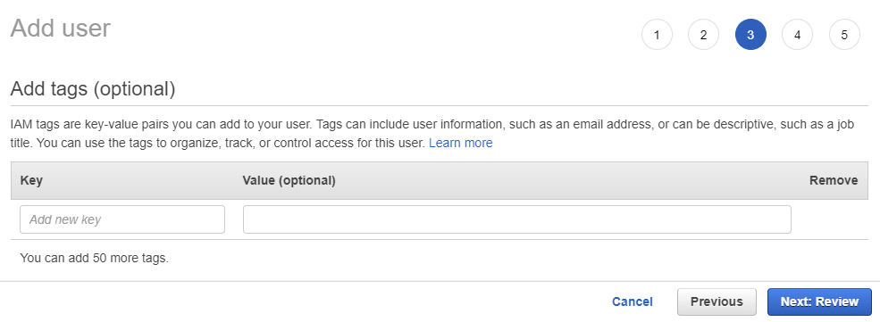
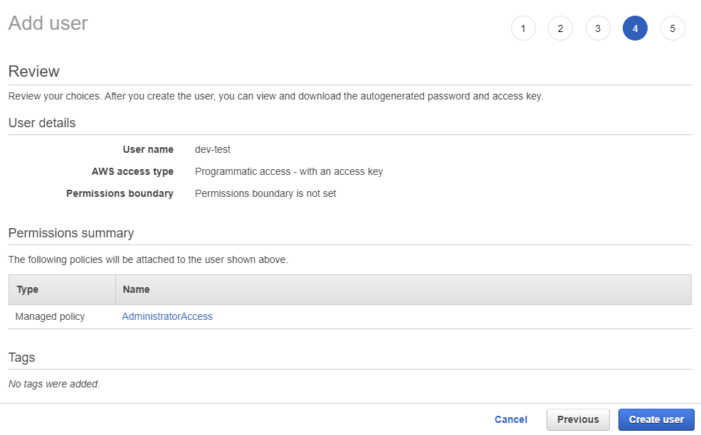
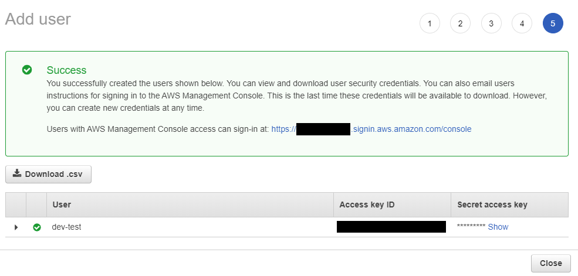
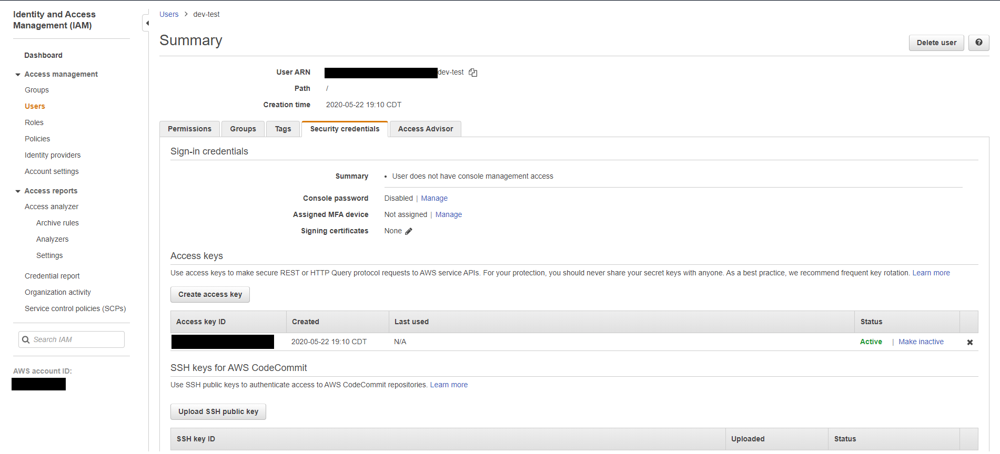
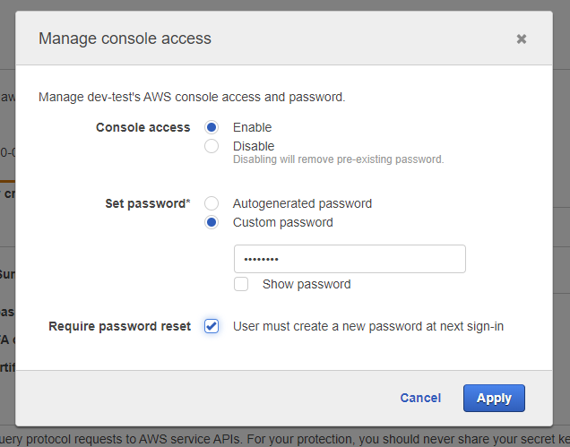
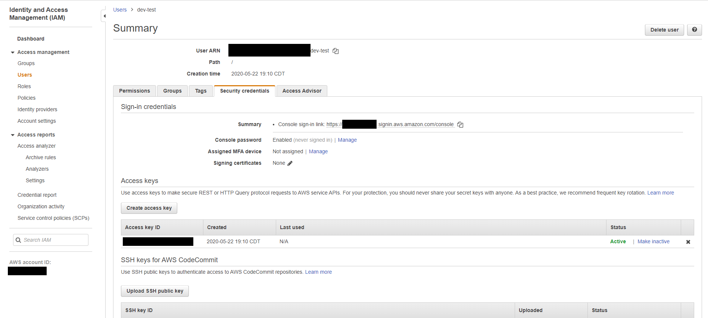

My company recently started working with AWS Amplify as the backend for a web application. A lot of the documentation and tutorials online are great, and the experience so far has been awesome. But there was a gap I found in showing how to get started with multiple developers on the same project. In this post, I'll walk you through setting up your project for multiple developers.

# Setup

I'm going to assume you've already gone through the process of setting up your Amplify project for a single user. If not, the [Amplify docs](https://docs.amplify.aws/start) are a great place to start. They will walk you through setting up the CLI tool, connecting to your base AWS account, and creating your Amplify project.

# Adding a Second Developer Account

1. Have the first user that created the initial Amplify project sign into the AWS console (https://console.aws.amazon.com/).

1. Click "Services" at the top, and then either find "IAM" under Security, Identity, & Compliance, or search for it using the search bar at the top of the dropdown.

1. In the IAM console, click Users in the left menu and then click Add User at the top of the next screen.

   

1. Enter a name for the user account and check Programmatic access below. Click Next: Permissions at the bottom of the screen.

   

1. On the next screen, select "Attach existing policies directly" and check the box next to "AdministratorAccess". Click Next: Tags at the bottom of the screen.

   

1. Enter any tags you want to use with the user. This step is optional. Click Next: Review at the bottom of the screen.

   

1. Double check that everything is set up correctly and click Create user at the bottom of the screen.

   

1. Make a note of the information on this screen: User name, access key ID, and Secret access key. Share these with the other developer you are working with for them to use when setting up the Amplify CLI.

   

# Optional: AWS Console Access

By default, this new IAM user will not have access to the AWS console to be able to access any of the resources Amplify will create. Use these steps if you want your associate to have console access as well.

1. Follow the steps above to login and get to the IAM console with your first user account.

1. In the IAM console, click Users on the left menu, and then click the name of the user you created in the previous steps. You should see the Summary page for that user.

   

1. Click the Security credentials tab. At the top under Sign-in credentials you should see "Console password Disabled | Manage". Click the Manage link.

1. In the modal that pops up, change the option next to Console access from Disable to Enable. The password options should appear. Either enter a temporary password and check the Require password reset box or use the Autogenerated password option. Click Apply.

   

1. If you selected the autogenerated password, the user's password will appear. Be sure you copy it down as there is no way to get it again once you close the modal.

1. Take note of the Console sign-in link that now appears above the Console password status. Share the console sign-in link and password with your fellow developer to allow them to access the AWS console.

   

Cover Photo by <a href="https://unsplash.com/@anniespratt?utm_source=unsplash&amp;utm_medium=referral&amp;utm_content=creditCopyText">Annie Spratt</a> on <a href="https://unsplash.com/s/photos/developer?utm_source=unsplash&amp;utm_medium=referral&amp;utm_content=creditCopyText">Unsplash</a>
