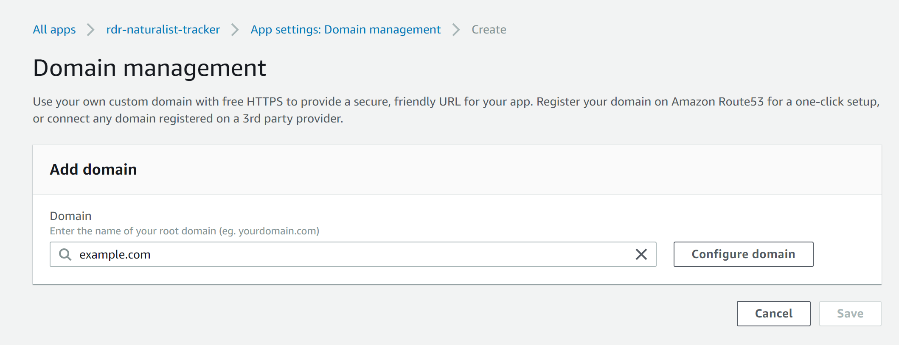
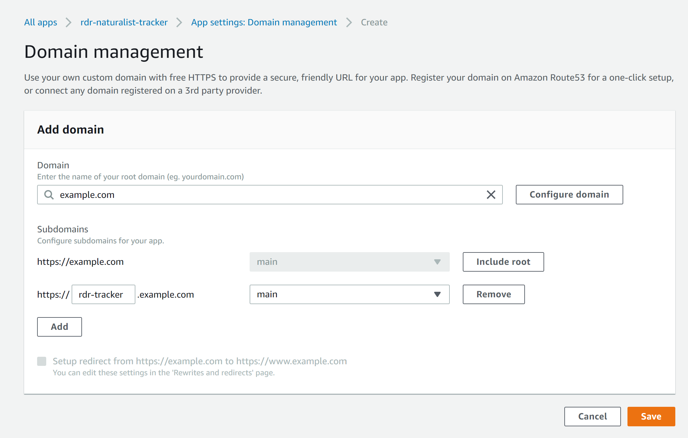
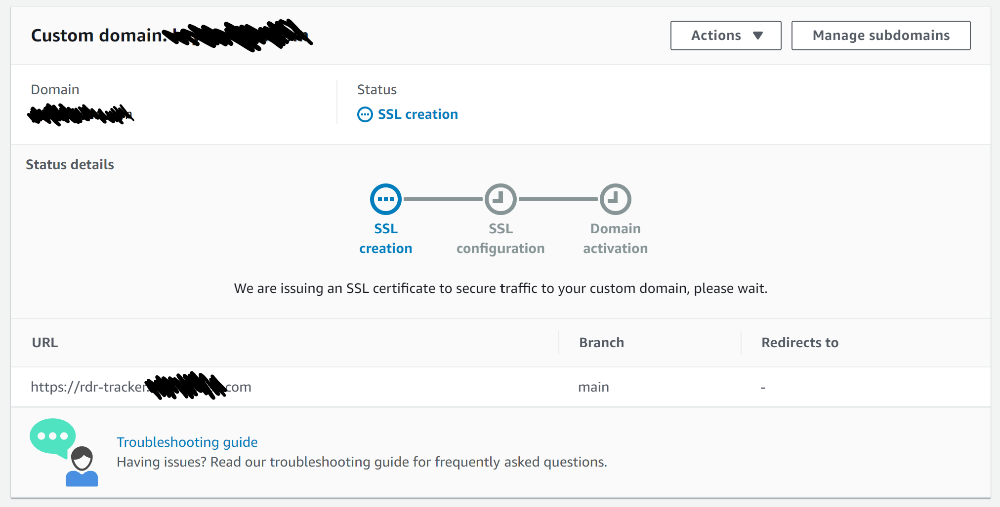

Like a lot of developers, I tend to work on side projects in my spare time. Some of them (ok, a lot of them) never really get to the point where I'm ready to pay to host them at their own domain. At the same time, it would be nice to be able to host some projects with an easy to remember URL without paying for yet another domain.

# Backstory

I ran into this recently with the [Red Dead Naturalist Tracker](http://red-dead-naturalist-tracker.richardsween.dev), a project I mentioned in last week's blog about localStorage (which you can find [here](/blogs/Using-Local-Storage-Web-App)). It was a project mostly for me, but I wanted to be able to get to it easily and share it in action. I used AWS Amplify for hosting since it's so easy and cheap to get up and running, and by default that does give me a publicly accessible URL (with https no less!) that looks something like https://my-branch-name.my-random-project-id.amplifyapp.com. Rolls right off the tongue and is super easy to recall, right?

But there's a better (and free!) way to manage these side project URLs. If you're somewhat familiar with Amplify, you may know that you can set a custom domain for you Amplify project, so you can host it at https://my-cool-domain.com for example. _But_, you don't have to set your Amplify project to run at the root of a domain.

# Prerequisites

For this to work, you do need a domain that you own that you manage. On this project I'm using my main domain at richardsween.dev. I have AWS Route 53 managing my domain's DNS, so it's really easy to pull that into Amplify, but you don't have to do that if your domain is managed elsewhere. Amplify will provide you with DNS records you will need to add to your domain to connect Amplify to your domain. Check out the [instructions for connecting a third-party DNS](https://docs.aws.amazon.com/amplify/latest/userguide/to-add-a-custom-domain-managed-by-a-third-party-dns-provider.html) to Amplify for more information.

# Setting up Project Subdomains with Amplify

First, log into the Amplify console and select the project you want to set up. In the left sidebar, under "App settings" click on "Domain management". You should see your default amplifyapp.com domain listed here. Click on the "Add domain" button in the upper right of the window.

Enter the domain you wish to use in the box. If it's managed by Route 53, it will be pre-populated in the dropdown for you. Then click the "Configure domain" button.

The subdomain configuration settings should now appear under your domain name. Two things to change here. First, click the "Exclude root" button next to the first subdomain entry. This will prevent Amplify from taking over the root domain URL. Next, change the second subdomain entry to whatever you want your subdomain to be named. In this example I called it "rdr-tracker", so once the changes are deployed, my project would be available at "https://rdr-tracker.example.com". If you have multiple branches or environments set up, make sure you choose the correct one in the dropdown next to the subdomain you've given it. I only have the one "main" branch, so I'll leave that as is. If you do have multiple branches that are deployed by Amplify, you can click the "Add" button to set up a unique subdomain for each one. When you are finished setting up subdomains, click "Save".

Now, Amplify will begin the process of setting up your domain, issuing the SSL certificate, and creating the DNS records you will need to be able to access your project. During this process, there may be steps Amplify needs you to do to verify your domain or set up DNS records if your DNS isn't managed by Route 53. Any actions you need to take will be shown on this page.

# Wrap-up

Once Amplify completes its configuration process your project will be live at its new, easy to remember, personalized subdomain! This process could be extended beyond simple side projects as well. Freelancers or agencies could preview client work or samples on a branded preview domain (Amplify lets you password protect projects if you wanted to restrict access). Companies could host multiple services under the same company domain with different leading subdomains. There are tons of applications for this approach.

I hope you found this technique useful. I've already used this approach in several personal and work projects with success. So the next time you want to show off some thing you've been working on, don't send someone a generic default URL, show them your personalized, branded URL that you set up!
