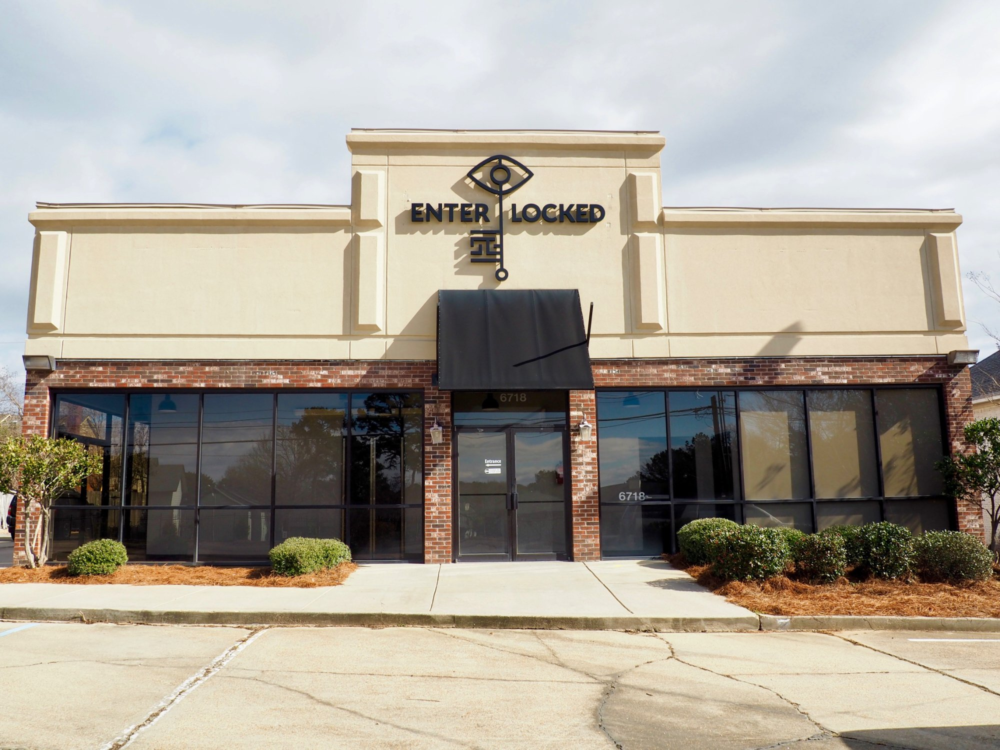
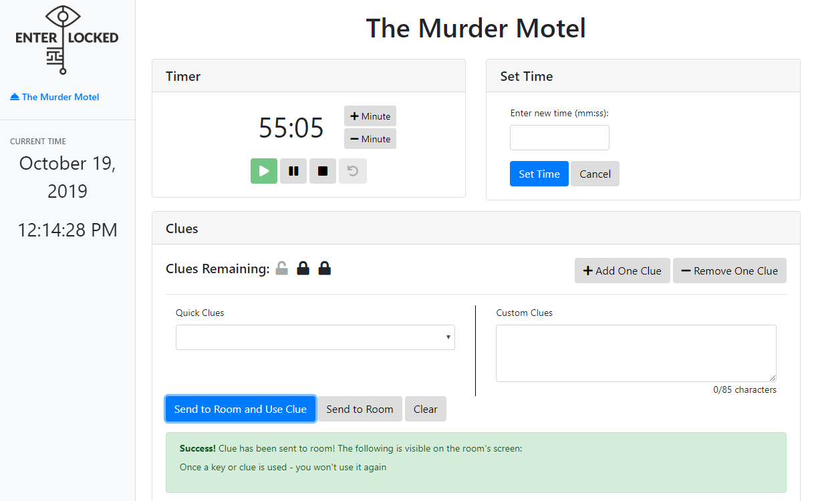
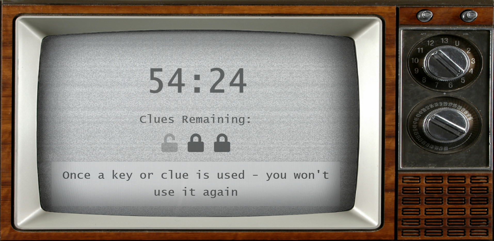

> Kayla and I built a timer display for a local escape room. The device, built using Python Flask running on a Raspberry Pi 3, showed the remaining time and other info for the players in the room, designed to look like a old dial TV. It used a web backend built with Vue for the game master to control the display.

<!-- endexcerpt -->

We met Clint and Paulina - owners of <a href="https://enterlocked.com/index.html">Enter/Locked</a> escape rooms in Ridgeland, MS through mutual friends. We talked about some of the challenges they were having and they mentioned they were paying a monthly fee for a tool they only used for a few of the features it provided. The tool was a web-based escape room manager that the game masters used to display the time to the players and send clues and show the clues remaining. It could also play videos and control smart lighting - features that they didn't use. After talking with them, we proposed building a self-contained replacement system tailored to their needs.

The requirements were fairly straightforward - replace the existing system they were using, but only implement the features they need. It was helpful that they had a "prototype" system they had experience with and knew pretty well what they wanted out of a new system. They needed a way to show the time and clues remaining to the players in the room, send messages to players, and play the background soundtrack. Ideally, it would still have a web interface for control so they could continue to use the Chromebook they use for their existing solution. They already had an HDMI cable running from the Chromebook to the TV so we needed to be able to connect to that. And of course the system needed to be simple and easy to use.

The project was built on a Raspberry Pi 3 serving as both the Flask web server for the controller web app as well as the video output to the screen in the room. The TV screen and controller app were written using Vue to handle state as well as manage communication between the front ends and the Flask server. When the Pi boots, a systemd script fires up a full screen web browser pointed at the TV screen URL. The controller web app connects to the server to control the timer and send messages to the room, either through a dropdown of frequent messages or a free-form text box for other text.

Overall, this was a super fun project to work on. Kayla and I got to work with a group of awesome people and develop a tool that they use every day. By listening to their problems, we were able to deliver something that was customized exactly to their needs and save them money in the long run. If you're looking for something fun to do in the Jackson, MS area, go check out Enter/Locked - play the Murder Motel room and see this project in action!
